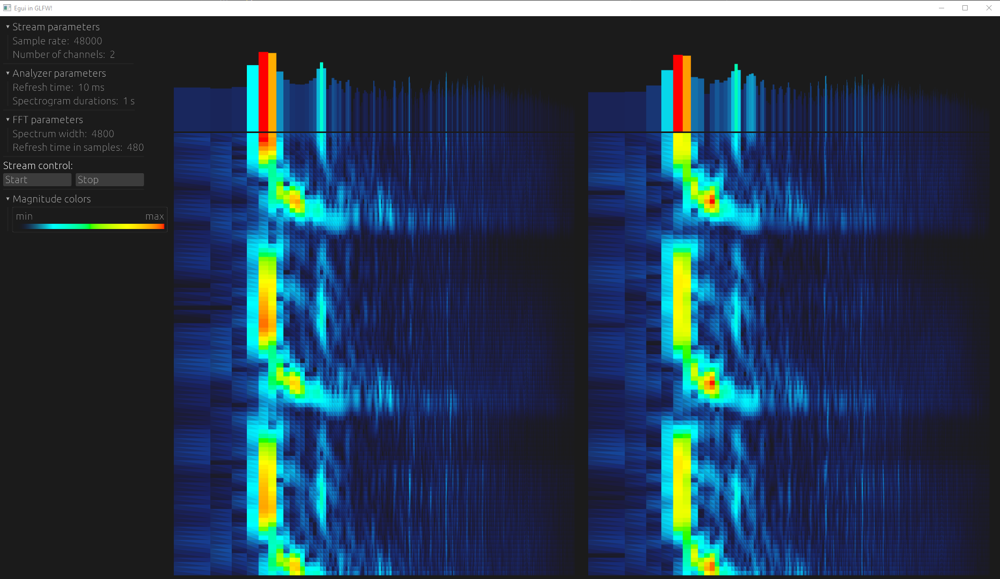

Current view of the application.
<!-- insert window.png -->

> [!CAUTION]
> "DEMO":\
> Epilepsy Warning:\
> https://www.youtube.com/watch?v=csQiFaLMgIg

## What is it?
It is an "educational" project. To learn rust on PC and ESP32.
Learn different aspects of Rust.
So this project is cancer but it has educational value for ME :D
Please don't take it as an example of good code.

## Realy short status
### Current functionality:
#### Common:
- Serialization/Deserialization of messages:
  - Trivial numeric types
  - Structs
  - Enums:
    - Unit
    - Named
    - Unnamed
#### PC App:
- Calculating the spectrum of the default loopback device.
- Rendering current spectrum
- Saving spectrum history.
- Rendering spectrogram
- Serialization/Deserialization of messages
- Receiving/sending commands
- Communication with ESP32C3
- Sending commands
#### ESP32C3:
- Connection to PC App
- Serialization/Deserialization of messages
- Receiving/sending commands
- WS2812 driving via PC App commands

### ToDo:
- Analyze of audio
